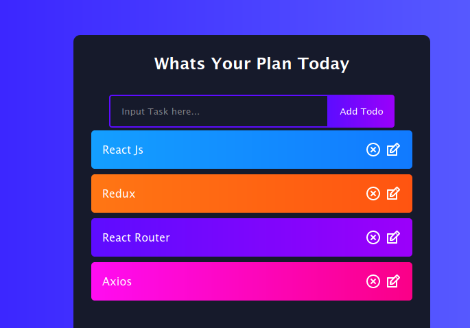

# Todo App React

### LIVE SITE: https://todoapp-crud-react.netlify.app



- workspace settings

```json
{
  "emmet.includeLanguages": {
    "javascript": "javascriptreact"
  },
  "editor.formatOnSave": true,
  "editor.formatOnPaste": true,
  "files.watcherExclude": {
    "**/.git/objects/**": true,
    "**/.git/subtree-cache/**": true,
    "**/node_modules/*/**": true
  }
}
```

Dependency Install

- `npx create-react-app todoapp`
- `cd todoapp`
- `yarn start`
